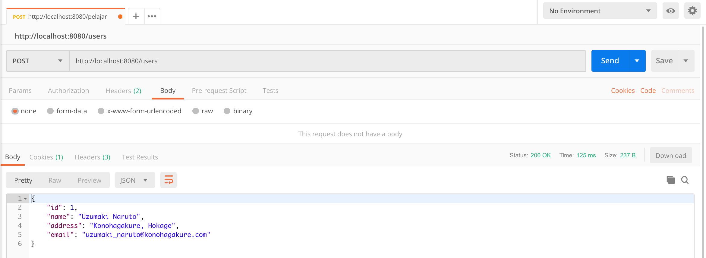
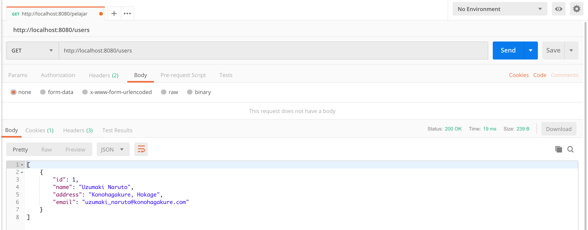
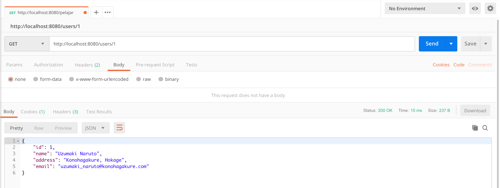

# springboot-jdbc

#### Overview

In this project, We will show how Spring boot and spring data can be used to integrate with postgresql.
#### Step 1 Download the code from github

`git clone https://github.com/hendisantika/springboot-jdbc.git`

#### Step 2 Build the project and run Integration Test

`mvn clean package`

#### Step 3 If you want to start the application

java -jar target/springboot-jdbc-0.0.1-SNAPSHOT.jar

#### Launch H2 Console

`http:/localhost:8080/h2-console`

Create Table in H2 :
```
CREATE TABLE users (record_id bigint NOT NULL AUTO_INCREMENT, name varchar(100), address varchar(250), email varchar(100), PRIMARY KEY (record_id));
```

#### Go to test folder and check all the test classes to understand the Integration Test implementation.

#### Create a New record - POST method

```
POST http://localhost:8080/users
```



#### Retrieve users - GET method
```
GET http://localhost:8080/users
```



#### Retrieve user by id
```
GET http://localhost:8080/users/1
```

